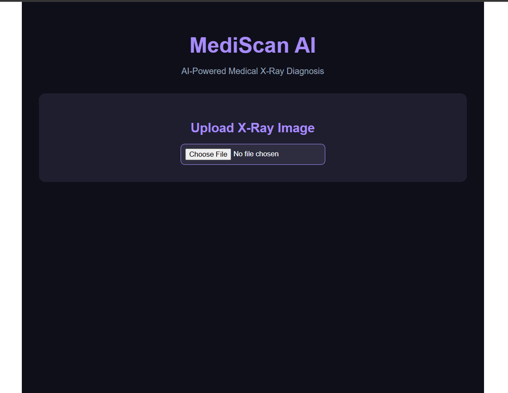
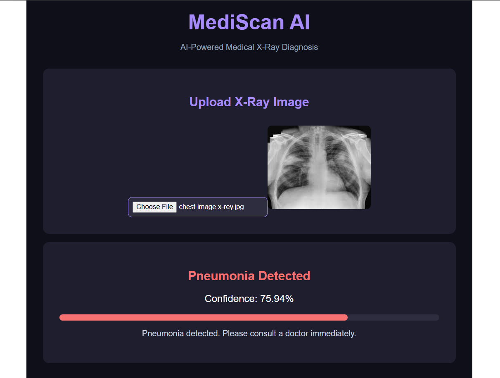
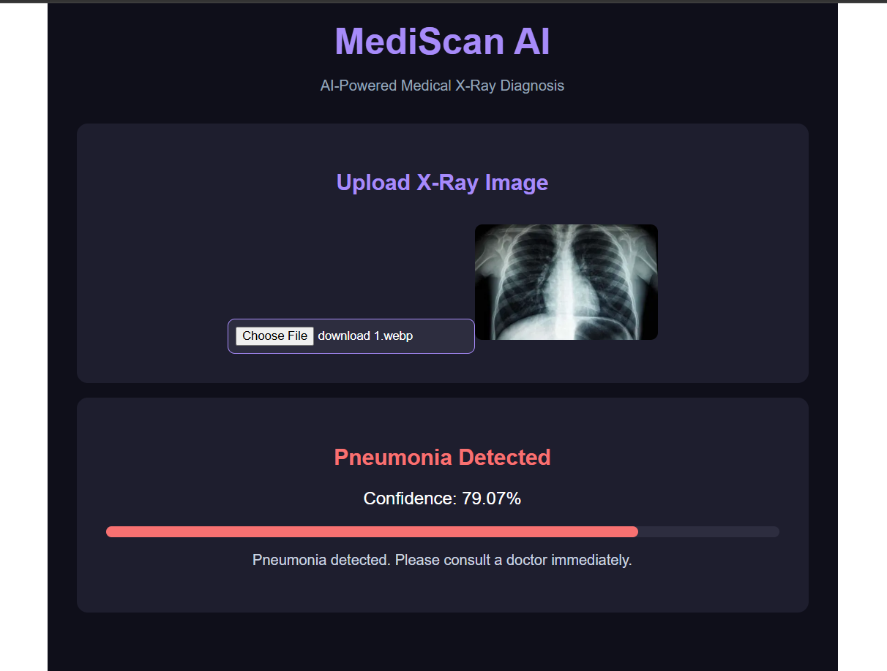

# MediScan AI 🏥

AI-Powered Medical X-Ray Diagnosis System using CNN + FastAPI + React

## Demo


## Features
- X-Ray image upload
- AI diagnosis (Normal / Pneumonia)
- Confidence score
- Grad-CAM heatmap visualization

## Tech Stack
- **AI Model:** CNN (VGG16 Transfer Learning) - 84% accuracy
- **Backend:** FastAPI + TensorFlow
- **Frontend:** React.js

## How to Run

### Backend
```bash
cd backend
pip install -r requirements.txt
uvicorn main:app --reload
```

### Frontend
```bash
cd frontend
npm install
npm start
```

## Dataset
Chest X-Ray Dataset from Kaggle (5,216 images)


## Screenshots

### Upload Page


### Diagnosis Result

